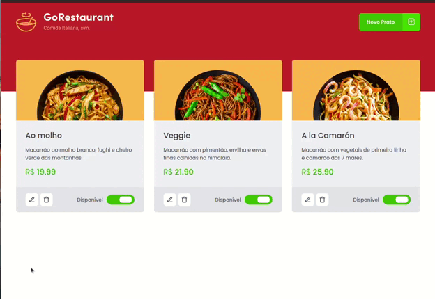

# goReataurant



> Projeto desenvolvido na trilha de ReactJs da Rocketseat. Nesse projeto foi utilizado typescript, styled-components, axios, dentre outras libs. O projeto é um catálogo de pratos de um restaurante, podendo adicionar novos pratos, atualizar informações e deletar.

### Ajustes e melhorias

O projeto ainda está em desenvolvimento e as próximas atualizações serão voltadas nas seguintes tarefas:

- [X] Design
- [ ] Resposividade
- [X] Funcionalidades
- [ ] Temas

## ⚙️ Pré-requisitos

* Node
* Git
## 🚀 Baixando

Para baixa, siga estas etapas:

Linux, macOS e Windows:
```
git clone https://github.com/devCleidison/desafio2-chapter2-reactjs.git
```
## ☕ Instalando as dependências


```
yarn ou npm
```
## 🚀 Executando o Back-end

```
yarn server ou npm server
```

## 🚀 Executando o Front-end

```
yarn start ou npm start
```


[⬆ Voltar ao topo](#goReataurant)<br>